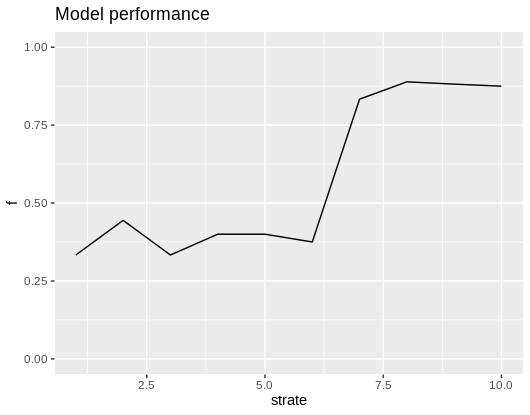
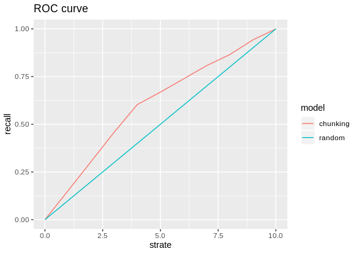

Le but de ce projet est de présenter la méthodologie que j'ai utilisée pour une problématique de matching de produits E-commerce
ainsi que les résultats.

# Méthode de matching

Les titres et les descriptions ont été utilisés en entrée d'un algorithme 
qui se base sur le principe NLP du chunking.

Grâce au package Pattern,  des entités de type Noun Phrases, Adjective Phrases, Prepositional Phrases et Verb Phrases
ont été extraites à partir des descriptions des produits.
Puis parmi les N-grams présents dans les titres des produits, seuls ont été sélectionnés 
ceux qui font partie des entités obtenues grâce au chunking.
Enfin, des découpages des 17000 titres des produits ont été obtenus.

Les découpages de tous les titres des produits ont donné en sortie des couples de produits 
qui partagent dans leurs titres ces entités / attributs.
Ce qui a donné au final, près de 2900 couples accompagnés d'un score de confiance ou score de similarité.  

# Résultats

Une application Shiny a permis de labelliser 100 couples tirés au hasard dans les déciles des scores de confiance.
Cette application Shiny est accessible ici: https://vince7th.shinyapps.io/shiny_app/

Ci-dessous, les résultats obtenus:

- courbe des % de match bien prédits pour chaque décile:

- courbe de ROC:

# Perspectives

Ce modèle obtenu grâce à la méthode du Chunking constitue une baseline. En effet, il assez bon du point de vue de la métrique Precision,
mais beaucoup moins bon du point de vue du Recall. Aussi afin d'avoir un Recall de meilleure qualité, on pourrait envisager
de créer un modèle de Machine Learning supervisé avec :
- la labellisation des 2900 couples avec "match" vs "unmatch"
- prédire si un couple est un couple de produits identiques
- utiliser comme features les embeddings des mots qui constituent chacun des titres des produits de chaque couple.
  On pourrait pour être plus précis en termes de sémantique, utiliser les embeddings des entités obtenues par la méthode 
  du chunking. Par exemple pour représenter l'entité "chocolat noir", on pourrait prendre la moyenne de l'embedding de "chocolat"
  et de l'embedding du mot "noir"
- utiliser comme feature la cosine similarity calculée grâce aux embeddings des attributs qui ne sont pas en commun entre les titres des
  produits d'un couple donné.

- Autre possibilité : 
- utiliser le score de confiance comme feature
- utiliser les embeddings des "breadcrumbs"
- exploiter les images (OCR ou features extraites des images) 

